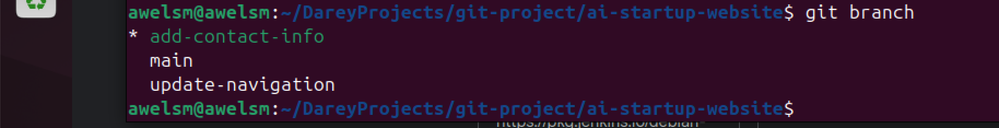
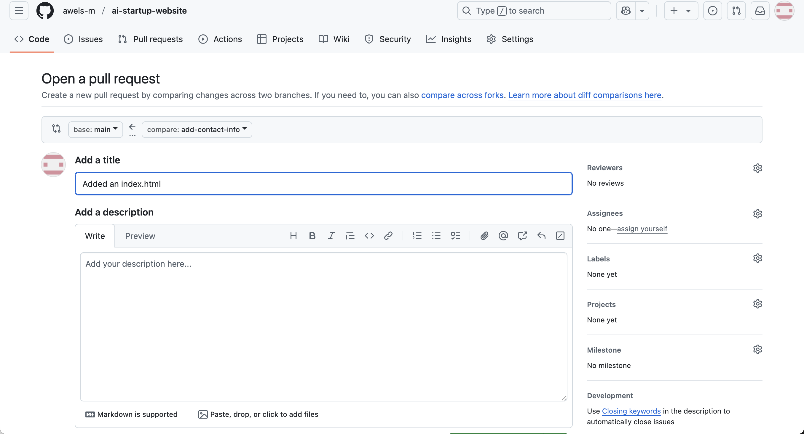

# Git-BranchingandMerging
here i will be submitting my project on Git branching and merging

# OBJECTIVE OF THE PROJECT 
Here i will be learning how to merge and branch changes. I am alos going to create a pull request and then merge the pull request into the main branch. A pull request is a feauture used in GitHub that allows you notify team members about changes you pushed to a branch in a repository. Essentially, its a request to review and pull in your contribution to the main project.

# HOW TO CREATE A PULL REQUEST
After Tom and Jerry have pushed their work to their respective branches, the next thing to do is to pull the request for his changes. 
A pull request (PR) is a way of notifying others that you’ve made changes to a codebase and are requesting those changes be reviewed and merged into the main branch. It allows team members to discuss the proposed modifications, review the code for quality, suggest improvements, and ensure the new code integrates well with the existing codebase. Creating a pull request is a standard best practice in collaborative software development to maintain code integrity and facilitate version control.

## NAVIGATE TO YOUR GITHUB REPOSITORY. 
I opened my web browser and went to my github page for the repository. the image below depicts this 

## SWITCH THE BRANCH TO MAIN
The image below depicts this.

How to Switch Branches to main on GitHub Website
	1.	Go to your repository on GitHub.
	2.	At the top-left of the repo file list, you’ll see a branch dropdown. It usually shows your current branch name (e.g., feature-branch, dev, etc).
	3.	Click on that branch dropdown.
	4.	In the search box that appears, type main.
	5.	Click on main from the list.

You’re now viewing the main branch of your repository.

## CREATE NEW PULL REQUEST AND REVIEW TOMS CHANGES
The image below depicts this 

These shows that the pull request for Tom was successful and its now time to merge the changes. the image below depicts this.

## MERGE THE CHANGES OF TOM
the image below depicts this 

## UPDATE JERRYS BRANCH
### SWITCH TO JERRYS BRANCH
This is done by running this command - git checkout add-contact-info
The image below depicts this

## PULL THE LATEST CHANGES FROM THE MAIN BRANCH
this is done by running this command - git pull origin main
the image below depicts this

## FINALIZING JERRYS CONTRIBUTION
The first to do is to push the updated branch to github
this is done by running this command "git push origin add-contact-info"
the image below depicts this

## CREATE A PULL REQUEST
A pull request is a way to propose changes you’ve made in a separate branch be added to the main project. It allows others to review your work, suggest improvements, and approve it before it’s merged. This helps ensure code quality, avoid conflicts, and keep the project organized—especially when working in a team.

The image below depicts this

the images above shows that the pull request was done successfully and I can proceed to merge the changes. 

## MERGE JERRY'S PULL REQUEST. 
The image below depicts this 
after iy has been reviewd, i can now successfully merge as seen in the image below. 

The image above shows that Jerrys Work from his branch was successfully merged. This brings me to the end of this project. 

# CONCLUSION

This project has given me practical experience in working with Git branching and merging, both through the GitHub interface and via the Linux terminal. I created and managed separate branches for two users, Tom and Jerry, each making changes to the same file. I successfully created and merged pull requests for both contributors—one using the GitHub website and the other through terminal commands. I encountered a real challenge during Jerry’s merge and resolved it by updating my Git configuration. This not only helped me understand common Git errors but also made me more confident using Git professionally. Overall, the project solidified my understanding of collaborative version control and gave me a strong foundation for future teamwork in software development.